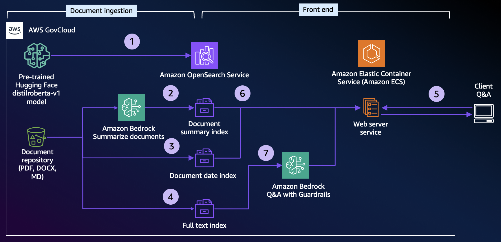

# RAG Chatbot with Amazon Bedrock, OpenSearch and document summaries in AWS GovCloud

## Overview

Many organizations are seeking ways to realize the value of their knowledge assets using interactive chat tools connected to document repositories.  Cloud-based generative AI services such as Amazon Bedrock and semantic search capabilities in services such as Amazon OpenSearch Service have put this goal increasingly within reach.  For organizations working within AWS GovCloud, specialized solutions may be required, and many published reference architectures do not apply to such use cases.

This repository enables the user to setup, run, and cleanup a chatbot in an AWS GovCloud account.  The chatbot provides a web-based interface for a user to ask questions and receive answers about information contained in a body of documents that can be in.docx, .pdf, or markdown (.md) format.

The user uploads a set of documents into an Amazon S3 bucket and opens a browser-based user interface to ask questions.  The user receives answers based on the information in the document store, and references to the source documents to enable further exploration.  An example screenshot of the user interface is below.

Completing this demonstration from setup to cleanup will take approximately 1.5 hours using the development and test deployment option.  Using the production-like deployment option will take approximately 2.5 hours.

## Goals

Goals of this repository include:
- Demonstrate how a generative AI-based chatbot can be deployed in AWS GovCloud
- Support common document types: .docx, .pdf, and .md
- Use AWS-managed pay-as-you-go services such as Amazon Bedrock to minimize total cost and management burden of a deployed solution
- Expose demonstration code in Amazon SageMaker Studio notebooks to support understanding and ability to modify and deploy in a production environment
- Demonstrate an advanced Retrieval Augmented Generation (RAG) technique using document summaries to filter search results to documents focused on the topic of the question presented by the user

## Architecture

The architecture makes use of the following major components in AWS GovCloud:
- Amazon S3 bucket to store the documents used as the knowledge repository
- Amazon OpenSearch domain to host a searchable index of the document repository with semantic search capability
- Amazon Titan Text Express Foundation Model on Amazon Bedrock to serve requests to answer user questions based on OpenSearch content matches
- Amazon SageMaker Studio to host demonstration notebooks and web user interface
- AWS CloudFormation to build the cloud infrastructure used by the demonstration

The diagram below illustrates the high-level architecture.

1. The Hugging Face distilroberta-v1 plugin is installed in OpenSearch by a Lambda function or a SageMaker Studio notebook
2. New documents in the S3 bucket are summarized using Amazon Bedrock and indexed into OpenSearch by a Lambda function or a SageMaker Studio notebook
3. New documents in the S3 bucket have their full text indexed into OpenSearch by a Lambda function or a SageMaker Studio notebook
4. A user accesses the Streamlit web user interface, which runs on Elastic Container Service or in SageMaker Studio
5. The user’s question is searched against the document summary index in OpenSearch to identify the most relevant documents.  The user’s question is searched against the full text index in OpenSearch.  Full text results from documents that have summary matches are promoted.
6. The most relevant search results are provided as context along with the user’s question to Amazon Bedrock’s Titan Text Express foundation model.  The foundation model transforms the search results into a concise, meaningful answer.  This answer along with document references are presented back to the user in the Streamlit web user interface.

## Semantic search capability

This chatbot uses the semantic search capability of Amazon OpenSearch to find relevant content based on the meaning of the user's question rather than relying on a keyword match approach.  This demonstration uses the Hugging Face distilroberta-v1 plugin to provide the embedding capability within OpenSearch.  Semantic search typically provides superior results over lexical search, since the user may not use the exact same terminology or keywords as those contained in the source documents.

## Document summary Retrieval Augmented Generation (RAG) technique

The search component includes a document summary feature as an advanced Retrieval Augmented Generation (RAG) technique.  This can improve the relevance of answers by comparing the question posed by the user to summaries of the documents in the document base, and ranking the results of full-text search from those documents with relevant summaries higher.  This approach can help reduce occurrences of search results from mentions in less relevant or authoritative documents.  The feature can be enabled or disabled by setting the parameter use_summary in the file /containers/streamlit/opensearch_retrieve_helper.py.  More details are in the Tunable parameters section below.  The diagram below illustrates how the document summary process can improve search results.

## Deployment options

Two deployment options are available.  One or both can be chosen using parameters in CloudFormation at stack creation.

1.	**Production-like** using Lambda functions to handle OpenSearch setup and index management, and web user interface hosted in Elastic Container Service with load balancer and internet gateway

2.	**Development and testing** using SageMaker Studio notebooks to handle OpenSearch setup and index management, and web user interface hosted in the SageMaker Studio environment that can be accessed by the local user

Both deployment options use a common CloudFormation script that creates the following key resources:
- VPC with subnets, endpoints and security groups
- OpenSearch domain
- S3 bucket to contain the files in the document base
- IAM roles and permissions needed to perform the demonstration

## Production-like deployment Overview

The production-like deployment demonstrates using containers in Elastic Container Service (ECS) and Lambda to support many users and an evolving document base.

A Lambda function runs as a custom resource from the CloudFormation stack to initialize the OpenSearch cluster with the embedding model.

The document ingestion pipeline uses S3 event notifications to Simple Queue Service (SQS) to a Lambda function that handles documents being added to or removed from S3 by updating the OpenSearch indices based on S3 events.  The use of SQS limits the concurrency of the OpenSearch Lambda indexing function to no more than two instances, which minimizes the poential for exceeding the capacity of the OpenSearch cluster.  The diagram below illustrates the ingestion pipeline architecture.

The web front end runs in a container on ECS Fargate behind an Application Load Balancer (ALB).

To deploy production-like, the following steps are required:
1.	Build the required container images into Elastic Container Registry (ECR):

    a. The Streamlit user interface container is based on files in the code repository folder /containers/streamlit

    b. The Lambda function container for OpenSearch setup is based on files in the code repository folder /containers/lambda_setup_opensearch

    c. The  Lambda function container for OpenSearch indexing is based on files in the code repository folder /containers/lambda_index

2.	Create the CloudFormation stack located in the /cloudformation folder in the code repository.

    a. Name the stack chatbot-demo.

    b. Set the CloudFormation stack parameters for the ECR repository names to point to the container images built in the step above: LambdaIndexEcrRepositoryName, LambdaOpenSearchSetupEcrRepositoryName, StreamlitImageEcrRepositoryName

    c. Set the following CloudFormation stack parameters to Yes:
    
    - CreateLambda – This will build the Lambda functions that perform one-time setup of OpenSearch and handle S3 events to keep the OpenSearch indices in sync with files in S3.

    - CreateStreamlitECS – This will build the ECS resources, load balancer and target group used by the Streamlit user interface.

3.	Provide document base files – After the stack is complete, drop sample document base files into the S3 bucket created by the stack and wait several minutes for file indexing in OpenSearch to complete.  You can monitor the progress of indexing by monitoring the CloudWatch logs for the lambda function chatbot_prod_lambda_index.

4.	Locate the URL of the ALB for the ECS service in the ECS console.  Open the URL in a browser on port 8501 to open the web user interface and ask questions.

## Development and testing deployment overview

The development and testing deployment provides the ability to see the code running in a SageMaker Studio environment to understand how it works, try modifications and see the results in real time.  After confirming the changes work as expected, files in the /containers folder of the code repository can be updated for building container images in the production-like deployment outlined in the section above.

Note that if the CreateLambda parameter is set to Yes as described in the Production-like deployment, the deployed Lambda functions will take precedence over the SageMaker Studio notebooks that set up the OpenSearch model and manage the indexing of documents.  These notebooks should not be run if the Lambda functions have been deployed, otherwise conflicts from duplicate processing will occur.

To deploy for development and testing, the following steps are required:
1.	Create the CloudFormation stack located in the /cloudformation folder in the code repository.

    a. Name the stack chatbot-demo.

    b. Set the following CloudFormation stack parameter to Yes:
        
    - SageMakerStudioSupport – This will build the VPC endpoints, NAT gateway and IAM permissions needed to enable the demo to run in a SageMaker Studio environment.

    c. It will take 20-30 minutes for the stack to complete.

2.	Create the SageMaker domain – After the stack is complete, run the script create_sagemaker_domain.sh in the sagemaker_studio folder of the code repository to create a SageMaker domain.

3.	Create a user in the SageMaker domain – After the SageMaker domain is created, use the console to create a user in the domain and launch SageMaker Studio.

4.	Copy the SageMaker files from the code repository to Studio – After Studio launches, copy the files from the /sagemaker_studio/notebooks, sagemaker_studio/streamlit, and /containers/streamlit folders of the code repository into a single new folder in Studio.

5.	Provide document base files – Drop sample document base files into the S3 bucket created by the stack.

6.	Run notebooks in Studio – Run notebooks 20, 22, and 23 to follow the process of populating OpenSearch indices and performing semantic searches.  Select default environment settings when opening notebooks.

7.	Ask questions in the user interface – To use the user interface within the Studio environment in single-user mode, run the scripts setup.sh and run.sh.  Click the link provided by the run.sh script to open a browser tab with the user interface and ask questions.

## Tunable parameters

Within the code in the /containers folder of the repository, several tunable parameters can be changed to best align with the use case and document base files.

chat.py

- text_gen_config – This is used to set the configuration for Titan Text Express as the LLM used to present answers to the users based on the document context retrieved through OpenSearch.  Conservative temperature and topP values are set by default to stay close to the original content.  Additional information on these parameters is available in the AWS documentation at https://docs.aws.amazon.com/bedrock/latest/userguide/model-parameters-titan-text.html

index_documents_helper.py

- text_gen_config – This is used to set the configuration for Titan Text Express as the LLM used to summarize documents used in the document summary index.  Conservative temperature and topP values are set by default to stay close to the original content.  Additional information on these parameters is available in the AWS documentation at https://docs.aws.amazon.com/bedrock/latest/userguide/model-parameters-titan-text.html

opensearch_retrieve_helper.py

- use_summary – If set to true the relevance of all the text in a document from the document summary index is used as part of the overall relevance score for chunks.  If set to false the document summary index is not used, and only the full text relevance scores are used to determine the relevance of chunks.

- max_length_rag_text – Sets the maximum length of context provided to Titan Text Express from the document context retrieved through OpenSearch.  Any context exceeding this length is truncated.  Since context is sorted in reverse order of relevance score, the least relevant context is most likely to be truncated.

- summary_hit_score_threshold – Sets the percentage value used as a cut-off for relevance scores retrieved from the OpenSearch document summary index.  Any document summary results with a relevance score less than this value times the highest document summary result’s relevance score are excluded from the context.

- full_text_hit_score_threshold – Sets the percentage value used as a cut-off for relevance scores retrieved from the OpenSearch full text index.  Any full text results with a relevance score less than this value times the highest result’s relevance score are excluded from the context.

- summary_weight_over_full_text – Sets the weighting of document summary result vs. full text result relevance scores in calculating the overall relevance score of a particular chunk.  Higher values weight the document summary relevance more.  Lower values weight the full text summary relevance more.

/containers/lambda_index/app.py

- max_file_size – Sets the maximum file size that will be indexed into OpenSearch.  Use this to filter out documents that are excessively large.  Higher values may exceed the 15 minute maximum run time for Lambda.

- Max_summary_length – Sets the maximum document summary size in characters.  Documents are progressively summarized to fit within this limit.  Smaller values produce more focused summaries.  Larger values require less time to produce.

## Markdown S3 key to weblink reference feature

In a case where markdown formatted source documents in S3 are also the source for a web site accessible to users, the references provided by the Streamlit user interface can optionally be configured to be clickable links to the target web pages.  This can help provide a better user experience in this use case by enabling one-click access to references.

To use this feature, set the parameters below in the file /containers/streamlit/opensearch_retrieve_helper.py

- use_s3_key_to_weblink_conversion – Sets the feature on or off based on the Boolean value True or False.  When set to True, the feature is enabled.

- s3_key_prefix_to_remove – Sets the portion of the S3 prefix to remove from markdown file S3 keys.

- weblink_prefix – Sets the prefix to add to the S3 key value after the s3_key_to_remove is removed.

- s3_key_suffix_to_remove – Sets the S3 key suffix to remove.

- weblink_suffix – Sets the suffix to add to the S3 key value after the s3_key_suffix_to_remove is removed.

## Cleanup

To clean up, perform the following steps:

1. Empty the S3 document bucket – In the S3 console, select the bucket created by the CloudFormation stack, click the Empty button and confirm.

2.	If a SageMaker domain was created, it must be deleted with the following procedure:

    a. Shut down Studio – If SageMaker Studio is running for a user created under the demonstration domain, shut it down by selecting Shut Down under the File menu and then selecting Shutdown All.

    b. Delete applications – In the SageMaker console, select the domain, then select the user.  If an application is still running for the user, delete it and wait for all pending application deletions to complete.

    c. Delete user – In the SageMaker console, delete the user created under the demonstration domain and wait for the deletion to complete.

    d. Delete domain

    - In the console, find the SageMaker domain ID.

    - In the console, open CloudShell and run the following command, replacing the DomainID placeholder with the actual domain ID from the console:
`aws --region us-gov-west-1 sagemaker delete-domain --domain-id {DomainId} --retention-policy HomeEfsFileSystem=Delete`

    - In the console, check the status of the domain.  Wait until the deletion completes.

3.	Delete the stack – In the CloudFormation console, select the chatbot-demo stack, choose Delete and confirm.  Deletion will take several minutes.

## Contributors

- Jason Stollings, Senior Solutions Architect

## Acknowledgements

Streamlit in SageMaker Studio portion adapted from the AWS Machine Learning Blog *Build Streamlit apps in Amazon SageMaker Studio* at https://aws.amazon.com/blogs/machine-learning/build-streamlit-apps-in-amazon-sagemaker-studio/

Semantic search in OpenSearch portion adapted from the GitHub repository *aws-samples/semantic-search-with-amazon-opensearch* at https://github.com/aws-samples/semantic-search-with-amazon-opensearch

## Security

See [CONTRIBUTING](CONTRIBUTING.md#security-issue-notifications) for more information.

## License

This library is licensed under the MIT-0 License. See the LICENSE file.

