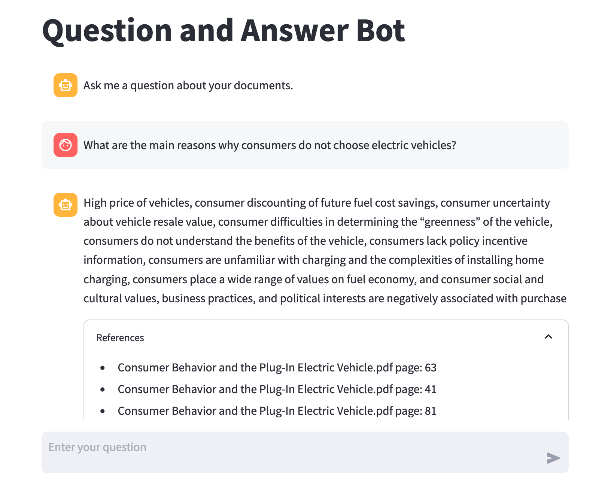

# RAG Chatbot with Amazon Bedrock, OpenSearch and document summaries in AWS GovCloud

## Overview

Many organizations are seeking ways to realize the value of their knowledge assets using interactive chat tools connected to document repositories.  Cloud-based generative AI services such as Amazon Bedrock and semantic search capabilities in services such as Amazon OpenSearch Service have put this goal increasingly within reach.  For organizations working within AWS GovCloud, specialized solutions may be required, and many published reference architectures do not apply to such use cases.

This repository enables the user to setup, run, and cleanup a chatbot in an AWS GovCloud account.  The chatbot provides a web-based interface for a user to ask questions and receive answers about information contained in a body of documents that can be in.docx, .pdf, or markdown (.md) format.

The user uploads a set of documents into an Amazon S3 bucket and opens a browser-based user interface to ask questions.  The user receives answers based on the information in the document store, and references to the source documents to enable further exploration.  An example screenshot of the user interface is below.



Completing this demonstration from setup to cleanup will take approximately 1.5 hours using the development and test deployment option.  Using the production-like deployment option will take approximately 2.5 hours.

## Goals

- Demonstrate how a generative AI-based chatbot can be deployed in AWS GovCloud
- Support commonly used document types: .pdf, .docx, and .md
- Use pay-as-you-go managed services such as Amazon Bedrock to minimize total cost and burden of a deployed solution
- Expose demonstration code in Amazon SageMaker Studio notebooks to enable understanding and ability to modify the code
- Demonstrate an advanced Retrieval Augmented Generation (RAG) technique using document summaries to filter search results to documents focused on the topic of the question presented by the user
- Demonstrate adjusting RAG search results based on document age to prefer newer content
- Demonstrate filtering harmful content from questions and answers using Guardrails for Amazon Bedrock

## Architecture

The architecture makes use of the following major components in AWS GovCloud:
- Amazon S3 bucket to store the documents used as the knowledge repository
- Amazon OpenSearch domain to host a searchable index of the document repository with semantic search capability
- Foundation Model on Amazon Bedrock to serve requests to answer user questions based on OpenSearch content matches
- Amazon SageMaker Studio to host demonstration notebooks and web user interface in development and test deployment
- Elastic Container Service (ECS) to host the web user interface in production-like deployment
- A Virtual Private Cloud (VPC) to support the OpenSearch, SageMaker Studio and ECS components
- AWS CloudFormation to build the cloud infrastructure used by the demonstration

The diagram below illustrates the high-level architecture.


1. The Hugging Face ```distilroberta-v1``` plugin is installed in OpenSearch by a Lambda function or a SageMaker Studio notebook
2. New documents in the S3 bucket are summarized using Amazon Bedrock and indexed into OpenSearch by a Lambda function or a SageMaker Studio notebook
3. New documents in the S3 bucket have their full text indexed into OpenSearch by a Lambda function or a SageMaker Studio notebook
4. New documents in the S3 bucket have their date indexed into OpenSearch by a Lambda function or a SageMaker Studio notebook
5. A user accesses the Streamlit web user interface, which runs on Elastic Container Service or in SageMaker Studio
6. The user’s question is searched against the document summary index in OpenSearch to identify the most relevant documents.  The user’s question is searched against the full text index in OpenSearch.  Full text results from documents that have summary matches are promoted.
7. The most relevant search results are provided as context along with the user’s question to a foundation model on Amazon Bedrock.  The foundation model transforms the search results into a concise, meaningful answer.  This answer along with document references are presented back to the user in the Streamlit web user interface.

## Semantic search capability

This chatbot uses the semantic search capability of Amazon OpenSearch to find relevant content based on the meaning of the user's question rather than relying on a keyword match approach.  This demonstration uses the Hugging Face ```distilroberta-v1``` plugin to provide the embedding capability within OpenSearch.  Semantic search typically provides superior results over lexical search, since the user may not use the exact same terminology or keywords as those contained in the source documents.

## Document summary Retrieval Augmented Generation (RAG) technique

The search component includes a document summary feature as an advanced Retrieval Augmented Generation (RAG) technique.  This can improve the relevance of answers by comparing the question posed by the user to summaries of the documents in the document base, and ranking the results of full-text search from those documents with relevant summaries higher.  This approach can help reduce occurrences of search results from mentions in less relevant or authoritative documents.  The feature can be enabled or disabled by setting the parameter ```use_summary``` in the file ```/containers/streamlit/opensearch_retrieve_helper.py```.  More details are in the Tunable parameters section below.  The diagram below illustrates how the document summary process can improve search results.


## Search based on document age

For many use cases, documents that are newer are more relevant, since older documents may contain out-of-date information.  This chatbot includes a search component that can lower the likelihood of older documents appearing in search results based on configurable parameters.

To enable this technique, a date must be assigned to each document as it is ingested.  For this demonstration, dates for .pdf and .docx files are set according to each document’s metadata creation date, and for .md files the date is set according to the last modified date in S3.  Other approaches of determining document date may be more appropriate for your use case.  The date of each Document is set in the index_documents_helper.py file in the /containers/lambda_index folder.  Here each document’s date is stored in an OpenSearch index which can later be queried.

To enable age-based search, the parameter use_date must be set to True and the years_until_no_value must be set to a number of years age where the document no longer has value.  These parameters are located in the file opensearch_retrieve_helper in the ```/containers/streamlit``` folder for production-like deployment and the file ```3_search_indices.ipynb``` in the ```/notebooks/sagemaker_studio``` folder for development and test.

Based on the above parameters, each full text search relevance score is adjusted in proportion to the document’s age until the ```years_until_no_value``` value is reached, at which point the relevance score is zero.  Full text hits with lower scores are less likely to appear than those with higher scores.  All full text search hits with adjusted relevance scores below the value set in the ```full_text_hit_score_threshold``` parameter are ignored

## Guardrails to filter harmful content

The chatbot includes a harmful content filter enabled by Guardrails for Amazon Bedrock.  This provides configurable thresholds to filter content across hate, insults, sexual, violence, misconduct, and prompt attack.  If a user asks a question, or an answer is retrieved that exceeds the guardrail threshold in any of these categories, the chatbot answers "Sorry, I cannot answer this question." or other block message configured in a CloudFormation stack parameter.

The CloudFormation template deploys a guardrail and a guardrail version.  The ```chat.py``` file in the ```/containers/streamlit``` folder gets the guardrail ID and version from the CloudFormation stack and applies those in every request to Bedrock.

## Deployment options

Two deployment options are available.  One must be chosen using the ```DeploymentMode``` parameter in CloudFormation at stack creation.

1.	**Development and testing** using SageMaker Studio notebooks to handle OpenSearch setup and index management, and web user interface hosted in the SageMaker Studio environment that can be accessed by the local user - this is the default option

2.	**Production-like** using Lambda functions to handle OpenSearch setup and index management, and web user interface hosted in Elastic Container Service with load balancer and internet gateway

Both deployment options use a common CloudFormation script that creates the following key resources:
- VPC with subnets, endpoints and security groups
- OpenSearch domain
- S3 bucket to contain the files in the document base
- IAM roles and permissions needed to perform the demonstration

## Development and testing deployment

The development and testing deployment provides the ability to see the code running in a SageMaker Studio environment to understand how it works, try modifications and see the results in real time.  After confirming the changes work as expected, files in the ```/containers``` folder of the code repository can be updated for building container images in the production-like deployment outlined in the section above.

Container build is not required for the development and testing deployment.

### To deploy for development and testing, the following steps are required:
**1.	Create the CloudFormation stack located in the ```/cloudformation``` folder in the code repository.**

 - Name the stack ```chatbot-demo```.

 - Set the CloudFormation stack parameter ```DeploymentMode``` to "DevTest"
        
 - It will take 20-30 minutes for the stack to complete.

**2. Request access to the Titan Text Express model in Amazon Bedrock** - If you haven't previously requested access to the Titan Text Express foundation model in Amazon Bedrock, you will need to do that using the instructions [here](https://docs.aws.amazon.com/bedrock/latest/userguide/model-access.html).  If you want to use Llama 3 models in place of Titan Text Express, you will need to also request those models using the same process.

**3.	Create the SageMaker domain** – After the stack is complete, run the script ```create_sagemaker_domain.sh``` in the ```/sagemaker_studio``` folder of the code repository to create a SageMaker domain.  CloudShell in the AWS console is a useful tool to run such a command.

**4.	Create a user in the SageMaker domain** – After the SageMaker domain is created, use the console to create a user in the domain and launch SageMaker Studio.

**5.	Copy the SageMaker files from the code repository to Studio** – After Studio launches, copy the files from the ```/sagemaker_studio/notebooks``` folder of the code repository into the root folder in SageMaker Studio.

**6.	Provide document base files** – Drop sample document base files into the S3 bucket created by the stack.

**7.	Run notebooks in Studio** – Run notebooks 1 and 2 to create and populate the OpenSearch indices.  Optionally, run notebook 3 to present questions and get responses.  Follow the instructions and prerequisites in each notebook.

**8.	Ask questions in the user interface** – To use the user interface within the Studio environment in single-user mode, follow the instructions in notebook 4.

## Production-like deployment

The production-like deployment demonstrates using containers in Elastic Container Service (ECS) and Lambda to support many users and an evolving document base.

A Lambda function runs as a custom resource from the CloudFormation stack to initialize the OpenSearch cluster with the embedding model.

The document ingestion pipeline uses S3 event notifications to Simple Queue Service (SQS) to a Lambda function that handles documents being added to or removed from S3 by updating the OpenSearch indices based on S3 events.  The use of SQS limits the concurrency of the OpenSearch Lambda indexing function to no more than two instances, which minimizes the potential for exceeding the capacity of the OpenSearch cluster.  The diagram below illustrates the ingestion pipeline architecture.


The web front end runs in a container on ECS Fargate behind an Application Load Balancer (ALB).

### To deploy production-like, the following steps are required:
**1.	Build the required container images into Elastic Container Registry (ECR).**  AWS CodeBuild may be used for the container build. 
 Buildspec files are provided in the repository.

 - The Streamlit user interface container is built using files in the code repository folder ```/containers/streamlit```

 - The Lambda function container for OpenSearch setup is built using files in the code repository folder ```/containers/lambda_setup_opensearch```

 - The  Lambda function container for OpenSearch indexing is built using files in the code repository folder ```/containers/lambda_index```

**2. Request access to the Titan Text Express model in Amazon Bedrock** - If you haven't previously requested access to the Titan Text Express foundation model in Amazon Bedrock, you will need to do that using the instructions [here](https://docs.aws.amazon.com/bedrock/latest/userguide/model-access.html).  If you want to use Llama 3 models in place of Titan Text Express, you will need to also request those models using the same process.

**3.	Create the CloudFormation stack located in the ```/cloudformation``` folder in the code repository.**

 - Name the stack ```chatbot-demo```.

 - Set the CloudFormation stack parameters for the ECR repository names to point to the container images built in the step above: ```LambdaIndexEcrRepositoryName```, ```LambdaOpenSearchSetupEcrRepositoryName```, ```StreamlitImageEcrRepositoryName```

 - Set the CloudFormation stack parameter ```DeploymentMode``` to "Prod"

**4.	Upload document base files to S3** – After the stack is complete, drop sample document base files into the S3 bucket created by the stack and wait several minutes for file indexing in OpenSearch to complete.  You can monitor the progress of indexing by monitoring the CloudWatch logs for the lambda function ```chatbot_prod_lambda_index```, or by monitoring in the web user interface using the document index status page desribed [here](#Document-index-status-feature).

**5.	Locate the URL of the ALB for the ECS service in the ECS console.**  Open the URL in a browser on port 8501 to open the web user interface and ask questions.

## Choice of foundation models for Q&A

Amazon Bedrock provides a choice of models in the us-gov-west-1 region.  The following options are available for Q&A in the chatbot:

 - **Amazon Titan Text G1 - Express (default)** - A good choice for many use cases.  Provides concise answers cost effectively.  Supports FedRAMP High use cases.  More information [here](https://docs.aws.amazon.com/bedrock/latest/userguide/titan-text-models.html).

 - **Meta Llama 3 8B Instruct** - A good choice where more expressive answers are desired and the use case falls within the Meta Llama 3 [Acceptable Use Policy](https://llama.meta.com/llama3/use-policy/).  More information [here](https://huggingface.co/meta-llama/Meta-Llama-3-8B-Instruct).

 - **Meta Llama 3 40B Instruct** - Similar to Llama 3 8B Instruct for Q&A use cases.  More information [here](https://huggingface.co/meta-llama/Meta-Llama-3-70B-Instruct).

See the [RAG search configuration section below](#/containers/streamlit/rag_search.cfg) for details on how to select the Q&A foundation model.

## Tunable parameters

Several tunable parameters can be changed to best align with the use case.  Default values will work in most cases.

#### /cloudformation/chatbot_demo_cfn.yml

- ```FiltersConfig``` in the ```BedrockGuardrail``` resource sets the strength for each type of content filter.  Additional information on the Bedrock Guardrails filter config is available in the AWS documentation at https://docs.aws.amazon.com/AWSCloudFormation/latest/UserGuide/aws-properties-bedrock-guardrail-contentfilterconfig.html
- Parameter ```BedrockGuardrailsBlockMessage``` sets the message given to the user if Bedrock Guardrails blocks the input or output.

#### /containers/streamlit/rag_search.cfg

- ```Text Gen``` section – These parameters select the foundation model and parameters used to present answers to the users based on the document context retrieved through OpenSearch.  Titan Text Express is the default foundation model for Q&A.  Conservative temperature and topP values are set by default to stay close to the content of the documents provided.  A Llama 3 model may optionally be selected in this section by uncommenting the line for the desired model and commenting other models.  Additional information on setting model parameters is available in the AWS documentation at https://docs.aws.amazon.com/bedrock/latest/userguide/model-parameters.html

- ```MaxLengthRagText``` – Sets the maximum length of context provided to the Amazon Bedrock foundation model from the document context retrieved through OpenSearch.  Any context exceeding this length is truncated.  Since context is sorted in reverse order of relevance score, the least relevant context is most likely to be truncated.  This value should be set to no more than the number of characters supported by the context length of the selected foundation model.

- ```FullTextHitScoreThreshold``` – Defines the percentile cut-off of full text hit scores that will be included in the result.  Any full text results with a relevance score less than this value times the highest result’s relevance score are excluded from the context.

- ```UseSummary``` – If set to True the relevance of all the text in a document from the document summary index is used as part of the overall relevance score for chunks.  If set to false the document summary index is not used, and only the full text relevance scores are used to determine the relevance of chunks.

- ```SummaryWeightOverFullText``` – Sets the weighting of document summary result vs. full text result relevance scores in calculating the overall relevance score of a particular chunk.  Higher values weight the document summary relevance more.  Lower values weight the full text summary relevance more.

- ```SummaryHitScoreThreshold``` – Sets the percentage value used as a cut-off for relevance scores retrieved from the OpenSearch document summary index.  Any document summary results with a relevance score less than this value times the highest document summary result’s relevance score are excluded from the context.

- ```UseDate``` - If set to True the age of each document will be used to adjust the relevance of full text hit scores downward as they age until the ```YearsUntilNoValue``` age is reached, at which point the relevance score will become zero.

- ```YearsUntilNoValue``` - Sets the number of years each document may age until it has no value as described above.

- ```S3 Key to Weblink Conversion``` section - These parameters are used for the feature to convert .md file references in search results to corresponding web pages.  Refer to the section [Markdown S3 key to weblink reference feature](#Markdown-S3-key-to-weblink-reference-feature) in this document for more information.

#### /containers/lambda_index/index_documents_helper.py

- ```text_gen_config``` – This is used to set the configuration for Titan Text Express as the foundation model used to summarize documents used in the document summary index.  Conservative temperature and topP values are set by default to stay close to the original content.  Additional information on these parameters is available in the AWS documentation at https://docs.aws.amazon.com/bedrock/latest/userguide/model-parameters-titan-text.html

#### /containers/lambda_index/app.py

- ```max_file_size``` – Sets the maximum file size that will be indexed into OpenSearch.  Use this to filter out documents that are excessively large.  Higher values may exceed the 15 minute maximum run time for Lambda.

- ```max_summary_length``` – Sets the maximum document summary size in characters.  Documents are progressively summarized to fit within this limit.  Smaller values produce more focused summaries.  Larger values require less time to produce.

## Document index status feature

The indexing status of the documents in the S3 bucket created by the CloudFormation stack can be viewed by selecting "Index status" in the side menu of the web user interface.

This shows a list of all the documents in the S3 bucket and the number of summary and full text index chunks in OpenSearch.  If zero chunks are shown then indexing has likely not yet begun for that document.  The date of each document as recorded in the date index can also be viewed by scrolling to the right. 

The screenshot below shows an example of the feature.


## Bedrock invocations CloudWatch dashboard feature

The CloudFormation stack can deploy a CloudWatch Logs group and a CloudWatch dashboard to provide observability on Bedrock invocations. 
 This will show the number of requests made using Bedrock Guardrails, the number of blocked requests, and the number of Bedrock tokens consumed.  These resources will be deployed if the CloudFormation stack parameter ```CreateBedrockInvocationLogs``` is set to "yes".

When this option is enabled, the stack deploys a Lambda custom resource that will update the Bedrock invocation logging setting for the account with a new IAM role and CloudWatch Logs group.  This will overwrite any existing Bedrock invocation logging setting in the account.  For this reason, the default value for the ```CreateBedrockInvocationLogs``` parameter is "no".  Set the parameter to "yes" if you are sure you will not interfere with existing Bedrock invocation logging in the account.

The screenshot below shows an example of the CloudWatch dashboard.


By enabling Bedrock invocation logging, you will be able to see the details of all Bedrock requests, including the content of the request and the response.  These are available in the log group created by the CloudFormation stack which can be found by searching CloudWatch log groups for ```bedrock-invocation```.  For Q&A requests, the Bedrock Guardrail status is also included in the logs. Summarization requests made to Bedrock during document ingestion do not include Guardrails actions as these are made without a Guardrail. 

## Markdown S3 key to weblink reference feature

This feature is for special use cases where markdown formatted source documents in S3 are also the source for a web site accessible to users.  By using this feature, the references provided by the Streamlit user interface can be configured as clickable links to the target web pages.  This can help provide a better user experience by enabling one-click access to web page references.

To use this feature, set the parameters below in the file ```/containers/streamlit/rag_search.cfg```

- ```use_s3_key_to_weblink_conversion``` – Sets the feature on or off based on the Boolean value True or False.  When set to True, the feature is enabled.

- ```s3_key_prefix_to_remove``` – Sets the portion of the S3 prefix to remove from markdown file S3 keys.

- ```weblink_prefix``` – Sets the prefix to add to the S3 key value after the ```s3_key_to_remove``` is removed.

- ```s3_key_suffix_to_remove``` – Sets the S3 key suffix to remove.

- ```weblink_suffi```x – Sets the suffix to add to the S3 key value after the ```s3_key_suffix_to_remove``` is removed.

## Cleanup

To clean up, perform the following steps:

**1. Empty the S3 document bucket** – In the S3 console, select the bucket created by the CloudFormation stack, click the Empty button and confirm.

**2.	In deveopment and testing mode the SageMaker domain must be deleted with the following procedure:**

 - **Shut down Studio** – If SageMaker Studio is running for a user created under the demonstration domain, shut it down by selecting Shut Down under the File menu and then selecting Shutdown All.

 - **Delete applications** – In the SageMaker console, select the domain, then select the user.  If an application is still running for the user, delete it and wait for all pending application deletions to complete.

 - **Delete user** – In the SageMaker console, delete the user created under the demonstration domain and wait for the deletion to complete.

 - **Delete SageMaker domain**

   - In the console, find the SageMaker domain ID.

   - Run the script delete_sagemaker_domain.sh in the sagemaker_studio folder of the code repository to delete the SageMaker domain. CloudShell in the AWS console is a useful tool to run such a command.

   - In the SageMaker console, check the status of the domain.  Wait until the status of the domain changes to deleted.

**3.	Delete the stack** – In the CloudFormation console, select the chatbot-demo stack, choose Delete and confirm.  Deletion will take several minutes.

## Supported region

This repository is intended for use in the AWS ```us-gov-west-1``` region.

The code in this repository has also worked in the ```us-east-1``` region.  Regions and partitions are referred by parameters in code to help enable region portability.  However, testing in regions outside ```us-gov-west-1``` is limited.  When deploying in development and test mode use SageMaker Studio Classic.

## Contributors

- Jason Stollings, Senior Solutions Architect

## Acknowledgements

Streamlit in SageMaker Studio portion adapted from the AWS Machine Learning Blog *Build Streamlit apps in Amazon SageMaker Studio* at https://aws.amazon.com/blogs/machine-learning/build-streamlit-apps-in-amazon-sagemaker-studio/

Semantic search in OpenSearch portion adapted from the GitHub repository *aws-samples/semantic-search-with-amazon-opensearch* at https://github.com/aws-samples/semantic-search-with-amazon-opensearch

## Security

See [CONTRIBUTING](CONTRIBUTING.md#security-issue-notifications) for more information.

## License

This library is licensed under the MIT-0 License. See the LICENSE file.

